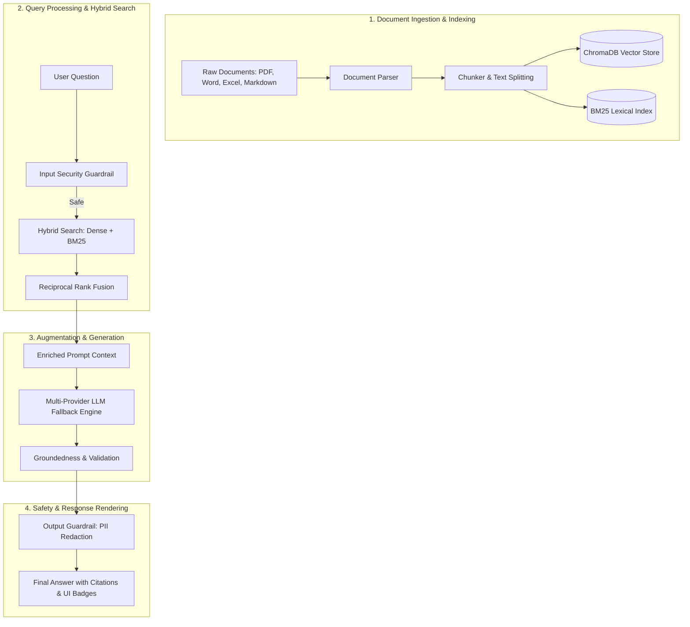

# Enterprise AI Knowledge Engine

A production-ready Retrieval-Augmented Generation (RAG) system built in Python, featuring hybrid vector search, multi-provider LLM fallback, enterprise security guardrails, and an interactive web interface.

---

## 📌 What is RAG?

**RAG (Retrieval-Augmented Generation)** is an AI architecture that enhances Large Language Models (LLMs) by connecting them to external knowledge sources (such as internal documentation, technical RFCs, incident postmortems, or database records).

Standard LLMs can only answer based on data they were trained on and may hallucinate or give outdated information. A RAG system solves this by **retrieving relevant facts from your own documents first**, injecting those facts into the prompt, and allowing the model to generate accurate, up-to-date answers backed by real citations.

---

## 🔄 How RAG Works (The Workflow)



### Detailed Workflow Steps

1. **Ingestion & Indexing**: External documents (PDF, DOCX, XLSX, Markdown) are parsed, divided into chunks, and stored as vector embeddings in ChromaDB and keyword indexes in BM25.
2. **Input Security & Hybrid Retrieval**: User queries pass through input security screening. Safe queries trigger a hybrid search combining dense semantic vectors and sparse BM25 keywords, fused using Reciprocal Rank Fusion (RRF).
3. **Augmentation & Generation**: The highest-ranked evidence chunks enrich the prompt context. The system calls the multi-provider LLM engine (Gemini, OpenAI, Groq, DashScope, or Local Mock) to generate an answer.
4. **Output Safety & Citation**: Output guardrails mask sensitive PII (emails, phone numbers) before rendering the verified response alongside source document citations.

---

## 🚀 Quick Start

### 1. Installation

```bash
git clone https://github.com/Sushanth-Patel/agentic-rag-pipeline.git
cd agentic-rag-pipeline

# Create virtual environment
python -m venv .venv
source .venv/bin/activate  # On Windows: .venv\Scripts\activate

# Install dependencies
pip install -r requirements.txt
```

### 2. Run the Web Application

```bash
python app.py
```

Open your web browser and navigate to: **`http://localhost:8000`**
