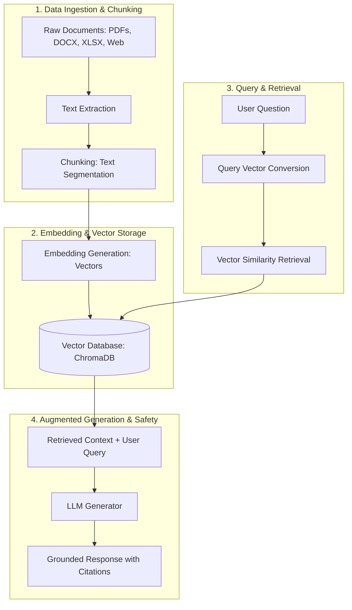

# RAG (Retrieval-Augmented Generation) Pipeline

A simple, production-ready system that lets you upload your own documents (PDFs, Word files, spreadsheets, web pages) and ask questions about them to get accurate, grounded AI answers backed by real citations.

---

## 📌 What is RAG?

**RAG (Retrieval-Augmented Generation)** is an AI architecture that enhances Large Language Models (LLMs) by connecting them to external knowledge sources (such as internal company files, technical documents, or database records).

Standard AI models can only answer based on past training data and may hallucinate or give outdated answers. A RAG system solves this by **retrieving relevant facts from your own documents first**, injecting those facts into the prompt, and generating accurate, up-to-date responses.

---

## 🔄 How RAG Works (The Workflow)



### Workflow Steps

- **Data Ingestion**: Raw documents (like PDFs, Word, Excel, databases, or web pages) are collected and extracted into text.
- **Chunking**: Large documents are split into smaller, manageable text segments to improve search accuracy.
- **Embedding Generation**: An embedding model converts text chunks into numerical vectors that capture their semantic meaning.
- **Vector Storage**: The vectors and their text are stored in a Vector Database for fast similarity searches.
- **Retrieval**: When a user asks a question, the system converts the query into a vector and searches the database for the most relevant text chunks.
- **Augmented Generation**: The retrieved context and the original user query are combined into a prompt and sent to the LLM, which writes a grounded response.

---

## 🚀 Quick Start

### 1. Installation

```bash
git clone https://github.com/Sushanth-Patel/agentic-rag-pipeline.git
cd agentic-rag-pipeline

# Create virtual environment
python -m venv .venv
source .venv/bin/activate  # On Windows: .venv\Scripts\activate

# Install dependencies
pip install -r requirements.txt
```

### 2. Run the Application

```bash
python app.py
```

Open your web browser and navigate to: **`http://localhost:8000`**
