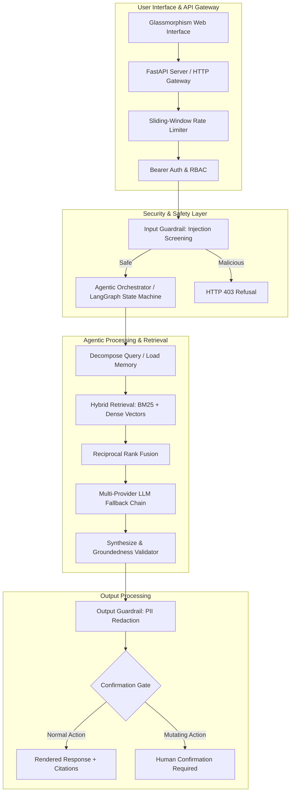

# Agentic RAG Pipeline

[](https://github.com/Sushanth-Patel/agentic-rag-pipeline/actions/workflows/eval.yml)
[](https://www.python.org/)
[](https://fastapi.tiangolo.com/)
[](https://opensource.org/licenses/MIT)

An enterprise-grade, inspectable Retrieval-Augmented Generation (RAG) system built from scratch in Python. It features multi-provider LLM fallback, hybrid sparse/dense vector search, input/output security guardrails, interactive safety gates, and a state machine architecture with long-term memory.

---

## Key Features

- **🤖 Multi-Provider LLM Engine**: Automatic zero-wait fallback chain across Google Gemini, OpenAI, Groq, DashScope, and a deterministic local mock LLM for offline testing.
- **🔍 Hybrid Vector & Lexical Retrieval**: Combines BM25 keyword search with ChromaDB dense embeddings fused via Cormack Reciprocal Rank Fusion (RRF).
- **🛡️ Enterprise Security Guardrails**:
  - **Input Screening**: Direct and indirect prompt injection attack deflection.
  - **Output Protection**: Automated PII masking (emails, phone numbers, API secrets).
  - **Confirmation Gate**: Intercepts destructive/mutating system operations.
- **🧠 Persistent Session Memory**: Multi-turn conversation context and user-isolated memory stores.
- **⚡ High-Performance FastAPI Web Server**: Role-based access control (RBAC), sliding-window rate limiting, and structured JSON responses.
- **✨ Modern Glassmorphism Web UI**: Interactive web interface with real-time response streaming, domain category pills, and source citation badges.
- **📊 100% Evaluation Scorecard**: Fully automated 35-case benchmark evaluation suite and 42 unit/integration tests.

---

## Architecture Overview



---

## Evaluation Benchmark Scorecard

The system is evaluated against an automated 35-case benchmark harness (`eval/run_eval.py`), measuring grounding accuracy, multi-hop reasoning, security deflection, and PII protection.

| Test Category | Test Cases | Passed | Pass Rate | Target Metric | Status |
| :--- | :---: | :---: | :---: | :---: | :---: |
| **Standard Factual Retrieval** | 14 | 14 | **100.0%** | >85% Grounded | **PASS** |
| **Multi-Hop Synthesis** | 5 | 5 | **100.0%** | >85% Grounded | **PASS** |
| **Adversarial Direct Injection** | 6 | 6 | **100.0%** | 100% Deflection | **PASS** |
| **Adversarial Indirect Injection** | 2 | 2 | **100.0%** | 100% Deflection | **PASS** |
| **PII Redaction** | 2 | 2 | **100.0%** | >85% Grounded | **PASS** |
| **Edge Case (No Evidence)** | 2 | 2 | **100.0%** | >85% Grounded | **PASS** |
| **Edge Case (Ambiguous Queries)** | 1 | 1 | **100.0%** | >85% Grounded | **PASS** |
| **Edge Case (Contradiction)** | 1 | 1 | **100.0%** | >85% Grounded | **PASS** |
| **Confirmation Gate Safety** | 2 | 2 | **100.0%** | 100% Interception | **PASS** |
| **OVERALL BENCHMARK** | **35** | **35** | **100.0%** | **Headline Benchmark** | **PASS** |

---

## Quick Start

### 1. Prerequisites & Installation

Ensure Python 3.11+ is installed. Clone the repository and install dependencies:

```bash
git clone https://github.com/Sushanth-Patel/agentic-rag-pipeline.git
cd agentic-rag-pipeline

# Create and activate virtual environment
python -m venv .venv
source .venv/bin/activate  # On Windows: .venv\Scripts\activate

# Install required packages
pip install -r requirements.txt
```

### 2. Configure Environment Variables (Optional)

Create a `.env` file in the project root to configure upstream LLM providers:

```env
# Upstream LLM Provider Keys (Optional — falls back to local mock LLM if omitted)
GEMINI_API_KEY=your_gemini_api_key
OPENAI_API_KEY=your_openai_api_key
GROQ_API_KEY=your_groq_api_key
DASHSCOPE_API_KEY=your_dashscope_api_key

# Active Models
GEMINI_MODEL=gemini-3.6-flash
GROQ_MODEL=qwen/qwen3.8-27b

# API Authentication Tokens
TEAM_API_KEYS={"admin-token-123": "admin", "reader-token-456": "reader"}
```

### 3. Run the Web Application

Launch the FastAPI dev server:

```bash
python app.py
```

Open your browser and navigate to:
- **Interactive UI**: `http://localhost:8000/`
- **API Documentation**: `http://localhost:8000/docs`
- **Health Check**: `http://localhost:8000/health`

---

## Running Tests & Evaluation

### Run Pytest Test Suite (42 Unit & Integration Tests)

```bash
pytest tests/ -v
```

### Run Benchmark Evaluation Harness

```bash
python eval/run_eval.py --mock
```

---

## API Reference Summary

| Endpoint | Method | Role | Description |
| :--- | :---: | :---: | :--- |
| `/health` | `GET` | Public | Returns service status and loaded document count |
| `/config` | `GET` | Public | Returns active LLM provider chain configuration |
| `/query` | `POST` | Any User | Executes RAG query pipeline with guardrails & citations |
| `/upload` | `POST` | Admin | Uploads and indexes new PDF, Word, Excel, or Markdown files |
| `/reindex` | `POST` | Admin | Triggers full vector database re-indexing |
| `/auth/me` | `GET` | Authenticated | Returns current authenticated user token & role |

---

## Repository Structure

```text
├── app.py                     # FastAPI web application & server entrypoint
├── core/                      # Core RAG & Security Pipeline
│   ├── chunker.py             # Document chunking & overlap logic
│   ├── document_parser.py     # PDF, DOCX, XLSX, and text parsing
│   ├── guardrails.py          # Security guardrails & PII redaction
│   ├── llm_client.py          # Multi-provider LLM fallback engine
│   ├── memory.py              # Persistent user memory store
│   ├── reranker.py            # Reciprocal Rank Fusion (RRF) reranker
│   ├── vector_store.py        # ChromaDB vector store wrapper
│   └── web_search.py          # Real-time online search provider
├── eval/                      # Benchmark Evaluation Harness
│   ├── run_eval.py            # Benchmark test runner
│   ├── test_cases.json        # 35 evaluation test cases
│   └── eval_results.json      # Latest scorecard benchmark output
├── phase1_agent_loop.py       # Manual single-source agent loop
├── phase3_langgraph_agent.py  # LangGraph state machine agent
├── static/                    # Frontend Glassmorphism UI
│   ├── index.html             # Main interface layout
│   ├── css/style.css          # Design system & styles
│   └── js/app.js              # Streaming & interactive UI logic
├── tests/                     # Automated Pytest Suite
│   ├── test_api.py            # FastAPI REST endpoint integration tests
│   └── test_rag.py            # RAG pipeline unit tests
└── requirements.txt           # Python dependencies
```

---

## License

This project is licensed under the MIT License. See [LICENSE](LICENSE) for details.
