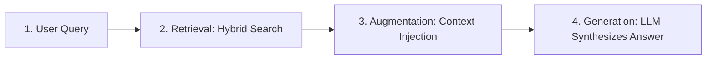

# Agentic RAG Pipeline

A lightweight, enterprise-ready Retrieval-Augmented Generation (RAG) system built in Python, featuring multi-provider LLM fallback, hybrid vector search, security guardrails, and an interactive web interface.

---

## 📌 What is RAG?

**RAG (Retrieval-Augmented Generation)** is an AI architecture that enhances Large Language Models (LLMs) by connecting them to external knowledge sources (such as internal documentation, technical RFCs, incident postmortems, or database records).

Standard LLMs can only answer based on data they were trained on and may hallucinate or give outdated information. A RAG system solves this by **retrieving relevant facts from your own documents first**, injecting those facts into the prompt, and allowing the model to generate accurate, up-to-date answers backed by real citations.

---

## 🔄 How RAG Works (The Workflow)



1. **Ingestion & Chunking**: External files (PDFs, Word, Excel, Markdown) are ingested and broken into smaller chunks.
2. **Indexing**: Chunks are stored in ChromaDB as vector embeddings and indexed with BM25 keyword search.
3. **Retrieval**: When a user submits a question, the system searches the knowledge base for the most relevant document chunks.
4. **Augmentation**: The retrieved chunks are added into the prompt context alongside the user's question.
5. **Generation & Safety**: The LLM synthesizes an accurate answer based strictly on the retrieved context while security guardrails mask PII and verify factual grounding.

---

## 🚀 Quick Start

### 1. Installation

```bash
git clone https://github.com/Sushanth-Patel/agentic-rag-pipeline.git
cd agentic-rag-pipeline

# Create virtual environment
python -m venv .venv
source .venv/bin/activate  # On Windows: .venv\Scripts\activate

# Install dependencies
pip install -r requirements.txt
```

### 2. Run the Web Application

```bash
python app.py
```

Open your web browser and go to: **`http://localhost:8000`**

---

## 📜 MIT License & What It Means

This project is licensed under the **[MIT License](LICENSE)**.

### What is the MIT License?
The **MIT License** is a short, simple, and permissive open-source license created by the Massachusetts Institute of Technology (MIT).

### What does "MIT Licensed" mean?
When a project is licensed under MIT, it gives anyone full freedom to use the code for almost any purpose.

- **Free Commercial & Private Use**: You can use, modify, distribute, and sell this software in personal, academic, or commercial projects.
- **Freedom to Modify**: You can rewrite, modify, or integrate this code into your own applications without paying royalties or seeking permission.
- **No Guarantee (As-Is)**: The software is provided "as is" without warranty, meaning the original creators are not liable for any issues or damages.
- **Only One Condition**: You must retain the original copyright notice and license permission text if you redistribute the code.
